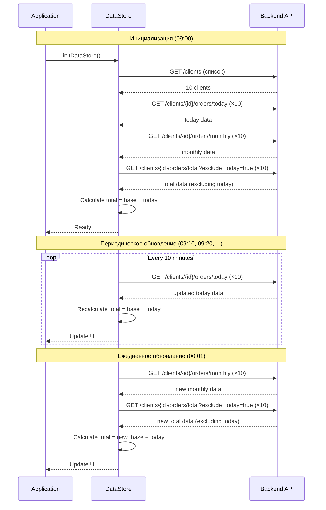

# Логика обновления данных в DGTV Dashboard

## Обзор

Система использует оптимизированную стратегию обновления данных, которая минимизирует нагрузку на API при сохранении актуальности информации в реальном времени.

## Типы данных

### 1. Данные за сегодня (Today Orders)
**Endpoint:** `GET /clients/{client_id}/orders/today`

**Стратегия обновления:**
- ✅ Загружаются при старте приложения
- ✅ Обновляются каждые 10 минут
- ✅ Триггерят пересчет общего количества заказов

**Интервал обновления:** Настраивается в `src/config.js` → `todayRefreshInterval`

**Пример ответа:**
```json
{
  "date": "2025-11-26",
  "orders_count": 1920,
  "period": {
    "from": "2025-11-26T00:00:00Z",
    "to": "2025-11-26T14:30:00Z"
  }
}
```

---

### 2. Данные за месяц (Monthly Orders)
**Endpoint:** `GET /clients/{client_id}/orders/monthly?exclude_today=true`

**Стратегия обновления:**
- ✅ Загружаются при старте приложения
- ✅ Обновляются один раз в день в 00:01
- ⚠️ НЕ включают текущий день

**Интервал обновления:** Настраивается в `src/config.js` → `dailyUpdateTime`

**Пример ответа:**
```json
{
  "period": {
    "from": "2025-10-27",
    "to": "2025-11-25"
  },
  "daily_orders": [1200, 1500, 1300, ...], // 30 значений
  "total": 45230,
  "average": 1507.67
}
```

**Почему без текущего дня?**
- График за месяц показывает последние 30 дней (вчера и назад)
- Текущий день отображается отдельно в блоке "СЕГОДНЯ"
- Это позволяет не обновлять график каждые 10 минут

---

### 3. Данные за все время (Total Orders)
**Endpoint:** `GET /clients/{client_id}/orders/total?exclude_today=true`

**Стратегия обновления:**
- ✅ Загружаются при старте приложения БЕЗ текущей даты
- ✅ Обновляются один раз в день в 00:01
- ✅ Автоматически суммируются с данными за сегодня на клиенте

**Интервал обновления:** Настраивается в `src/config.js` → `dailyUpdateTime`

**Формула расчета:**
```javascript
total_orders = total_excluding_today + today_orders
```

**Пример ответа:**
```json
{
  "orders_count": 4993238,
  "exclude_today": true,
  "since": "2020-01-01"
}
```

**Логика обновления общего количества:**

1. **При старте системы (09:00):**
   - Загружаем `total_excluding_today` = 4,993,238 (данные до 26.11.2025 00:00)
   - Загружаем `today_orders` = 1,200
   - **Отображаем:** 4,994,438

2. **Через 10 минут (09:10):**
   - `total_excluding_today` остается = 4,993,238 (не запрашиваем)
   - Обновляем `today_orders` = 1,350
   - **Отображаем:** 4,994,588 (пересчет без запроса к серверу)

3. **В полночь (00:01 следующего дня):**
   - Обновляем `total_excluding_today` = 4,995,158 (вчерашние 1,920 добавлены на сервере)
   - Обновляем `today_orders` = 0 (новый день)
   - **Отображаем:** 4,995,158

---

## Расписание обновлений

### Визуализация

```
00:00 ─────────────────────────────────────────────────────────── 23:59
  │                                                                   │
  │                                                                   │
00:01 ← Ежедневное обновление                                        │
  │    - Monthly data                                                │
  │    - Total data (excluding today)                                │
  │                                                                   │
  ├──10min──┼──10min──┼──10min──┼──────────────┼──10min──┼──10min──┤
  │         │         │         │               │         │         │
  └─Today───┴─Today───┴─Today───┴───── ... ────┴─Today───┴─Today───┘
    Update   Update   Update              Update   Update
```

### Таблица обновлений

| Время | Today | Monthly | Total (base) | Total (calculated) |
|-------|-------|---------|--------------|-------------------|
| 00:01 | ✅    | ✅      | ✅           | ✅                |
| 00:11 | ✅    | ❌      | ❌           | ✅ (auto)         |
| 00:21 | ✅    | ❌      | ❌           | ✅ (auto)         |
| ...   | ...   | ...     | ...          | ...               |
| 23:51 | ✅    | ❌      | ❌           | ✅ (auto)         |

---

## Конфигурация

### Файл: `src/config.js`

```javascript
export const config = {
  // Интервал обновления данных за сегодня (в миллисекундах)
  // 10 минут = 600000 мс
  todayRefreshInterval: 600000,
  
  // Время ежедневного обновления месячных данных и данных за все время
  // Формат: HH:MM (24-часовой формат)
  dailyUpdateTime: '00:01',
  
  // Другие настройки...
}
```

### Изменение интервалов

**Изменить частоту обновления данных за сегодня:**
```javascript
todayRefreshInterval: 300000, // 5 минут
todayRefreshInterval: 900000, // 15 минут
```

**Изменить время ежедневного обновления:**
```javascript
dailyUpdateTime: '01:00', // В 1 час ночи
dailyUpdateTime: '23:59', // В 23:59
```

---

## Структура данных в хранилище

### Файл: `src/services/dataStore.js`

```javascript
// Структура данных для каждого клиента
{
  client_id: "yakitoriya",
  client_name: "Якитория",
  color: "#dc2626",
  
  today: {
    date: "2025-11-26",
    orders_count: 1920,
    period: { ... }
  },
  
  monthly: {
    period: { ... },
    daily_orders: [1200, 1500, ...],
    total: 45230,
    average: 1507.67
  },
  
  total: {
    orders_count: 4995158,  // Рассчитанное значение
    since: "2020-01-01",
    exclude_today: true
  },
  
  totalExcludingToday: 4993238  // Базовое значение с сервера
}
```

---

## Преимущества данной архитектуры

### 1. Минимальная нагрузка на API
- ✅ Исторические данные запрашиваются 1 раз в день
- ✅ Только данные за сегодня обновляются часто
- ✅ Общее количество пересчитывается локально

### 2. Актуальность в реальном времени
- ✅ Данные за сегодня обновляются каждые 10 минут
- ✅ Общее количество обновляется автоматически при каждом обновлении today

### 3. Эффективное использование ресурсов
- ✅ Сервер кэширует исторические данные на 24 часа
- ✅ Клиент не делает избыточных запросов
- ✅ Пропускная способность используется оптимально

### 4. Гибкость настройки
- ✅ Все интервалы настраиваются в одном месте
- ✅ Время ежедневного обновления можно изменить
- ✅ Легко адаптировать под разные сценарии использования

---

## Пример расчета трафика

### Для 10 клиентов за 1 день:

**Запросы к API:**
- **Today updates:** 10 клиентов × 144 обновления/день (каждые 10 мин) = 1,440 запросов
- **Daily updates:** 10 клиентов × 2 запроса (monthly + total) = 20 запросов
- **ИТОГО:** 1,460 запросов в день

**Альтернативный подход (обновление всего каждые 10 минут):**
- 10 клиентов × 3 запроса × 144 раза = 4,320 запросов в день

**Экономия:** 66% запросов!

---

## Мониторинг обновлений

### В консоли браузера

Все обновления логируются с временными метками:

```
🚀 Инициализация хранилища данных
⏱️ Интервал обновления данных за сегодня: 600 секунд
⏱️ Ежедневное обновление данных в: 00:01
📋 Загрузка списка клиентов с сервера...
✅ Загружено клиентов: 10
🔄 Обновление данных за сегодня... 09:00:00
✅ Данные за сегодня для Якитория: 1200 заказов
📅 Обновление данных за месяц... 09:00:01
✅ Данные за месяц для Якитория обновлены
🏆 Обновление данных за все время... 09:00:02
✅ Данные за все время для Якитория: 4994438 заказов
⏰ Следующее ежедневное обновление через 901 минут
```

### Отладка

Для проверки корректности работы:

1. Откройте DevTools → Console
2. Следите за логами обновлений
3. Проверьте, что `totalExcludingToday` не меняется между ежедневными обновлениями
4. Убедитесь, что `total.orders_count` обновляется каждые 10 минут

---

## Диаграмма последовательности



---

## Обработка ошибок

### Fallback на мок-данные

Если API недоступен, система автоматически переключается на мок-данные:

```javascript
try {
  const todayData = await getTodayOrders(client.id)
  // Используем реальные данные
} catch (error) {
  console.warn('API недоступен, используем мок-данные')
  const todayData = generateMockTodayData()
  // Используем мок-данные
}
```

### Уведомления об ошибках

- ❌ Ошибки логируются в консоль с префиксом `❌`
- ✅ Успешные операции логируются с префиксом `✅`
- ⚠️ Предупреждения логируются с префиксом `⚠️`

---

## Тестирование

### Проверка логики обновления

```javascript
// В консоли браузера
import { getClientData } from './services/dataStore.js'

// Получить данные клиента
const data = getClientData('yakitoriya')

console.log('Today:', data.today.orders_count)
console.log('Base (excluding today):', data.totalExcludingToday)
console.log('Total (calculated):', data.total.orders_count)
console.log('Formula check:', data.totalExcludingToday + data.today.orders_count === data.total.orders_count)
```

### Симуляция времени до полуночи

```javascript
// Изменить время ежедневного обновления для тестирования
config.dailyUpdateTime = '14:35' // Через 5 минут от текущего времени
```

---

## Дополнительные ресурсы

- [API Specification](./API_SPECIFICATION.md) - Полная спецификация API
- [Integration Guide](./INTEGRATION_GUIDE.md) - Руководство по интеграции
- [README](./README.md) - Общая документация проекта
